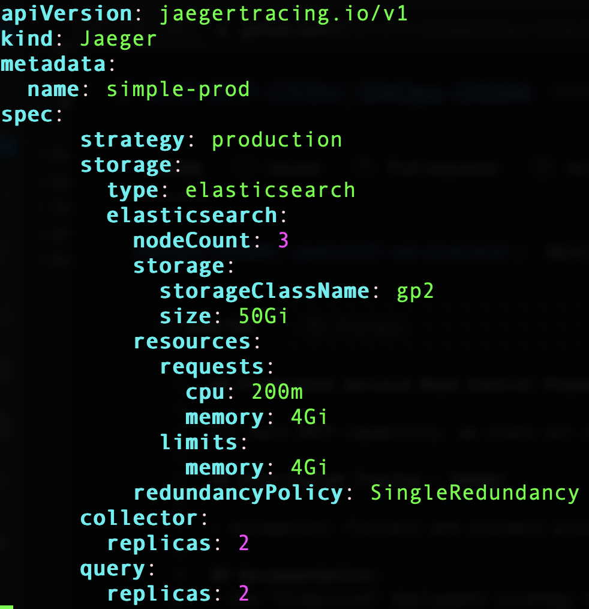

## Production Service Mesh Control Plane (SMCP) Best Practices and Recommendations

For each SMCP capability, we state our assumptions first and then our recommendation based on RH best practices.

## Distributed Tracing - Jaeger  

- Assumption: flexible and scalable production-ready Service Mesh monitoring capability platform

### Recommendation:
- Use "Production" deployment strategy type in Jaeger CRD:
    Intended for production environments, where long term storage of trace data is important.  
    The Agent can be injected as a sidecar on the instrumented application. 
    The Query and Collector services are configured with a supported storage type, which is currently Elasticsearch. 
    Multiple instances of each of these components can be provisioned as required for performance and resilience purposes.
- Elasticsearch propeties:
    - storageClass: use same as provisioned by the Elasticsearch operator
    - redundancyPolicy: defines how Elasticsearch shards are replicated across data nodes in the cluster
        e.g. SingleRedundancy(one replica shard)
    - nodeCount: number of Elasticsearch nodes. For high availability use at least 3 nodes. 
        Do not use 2 nodes as “split brain” problem can happen.
- Collector: the component responsible for receiving the spans that were captured by the tracer and 
    writing them to persistent Elasticsearch storage when using the production strategy
    The Collectors are stateless and thus many instances of Jaeger Collector can be run in parallel. 
    Collectors require almost no configuration, except for the location of the Elasticsearch cluster.
- Configuration Steps:
    Create the Jaeger CRD first, then configure SMCP to use that resource. 
    The Jaeger resource must be in the same namespace as the SMCP resource. 
    This approach gives users complete flexibility for configuring Jaeger.

The following Jaeger CRD yaml snippet illustrates the above points.

## Control Plane Security - mTLS

- Assumption: secure communication within Control Plane components (e.g. between Istiod pod and Jaeger pod)

## Data Plane Security - mTLS

- Assumption: workloads within the mesh Do Not call out to services outside the mesh; secure communication within the mesh between namepaces/projects (e.g. between bookinfo and sleep)

### Recommendation:
- Set "mtls: true" under Security: controlPlane
    By default, Red Hat OpenShift Service Mesh generates a self-signed root certificate and key and uses them to sign the control plane component workload certificates

- Set "mtls: true" under Security: dataPlane
    By default, Red Hat OpenShift Service Mesh generates a self-signed root certificate and key and uses them to sign the data plane component workload certificates
    
    
## OSSM Fine Grained Security Protocol Requirements

- Assumption: need more detailed feedback from Telus regarding environment specific requirements for encrypted traffic in the service mesh, you can control the cryptographic functions, etc.
    
## Sampling Setting for Enovy Proxy

    The sampling rate determines how often the Envoy proxy generates a trace. You can use the sampling rate option to control what percentage of requests get reported to your tracing system. 
    You can configure this setting based upon your traffic in the mesh and the amount of tracing data you want to collect. You configure sampling as a scaled integer representing 0.01% increments. 
    For example, setting the value to 10 means to sample 0.1% of traces, setting the value to 500 samples 5% of traces, and a setting of 10000 samples 100% of traces.

## References

Service Mesh Jaeger:
https://docs.openshift.com/container-platform/4.9/service_mesh/v2x/ossm-reference-jaeger.html
